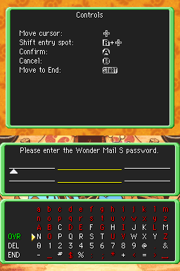

Generators for Wonder Mail S passwords in Pokemon Mystery Dungeon: Explorers of Sky. Includes:

- [HTML/JavaScript](https://github.com/lorcan2440/PMD-2-Wonder-Mail-Generator/tree/main/html-js) (webpage, password output suitable for copy-pasting)
- [Python](https://github.com/lorcan2440/PMD-2-Wonder-Mail-Generator/tree/main/python) (simple script, password output suitable for copy-pasting)
- [Lua script](https://github.com/lorcan2440/PMD-2-Wonder-Mail-Generator/tree/main/lua) for copy-pasting Wonder Mail S passwords into the game (Desmume x86 ROM)

To use this generator:
- Run one of the programs here to produce a password.
- In the in-game menu, go to Wonder Mail S > Receive Wonder Mail S > Password:

- Type the password in and press END - if entered correctly it will be added:

To be made soon:

- a simple PyQt5 GUI app using the python generator

Algorithm sourced from: [https://syphist.com/pmd/explorers/wondermail.html](https://syphist.com/pmd/explorers/wondermail.html)

Original sources (all archived):

https://web.archive.org/web/20141009024914/http://www.upokecenter.com/content/pokemon-mystery-dungeon-2-in-depth-guides
https://web.archive.org/web/20141010110725/http://www.upokecenter.com/games/dungeon2/guides/wondermail.php
https://web.archive.org/web/20140806123203mp_/http://www.upokecenter.com/content/pokemon-mystery-dungeon-passwords
